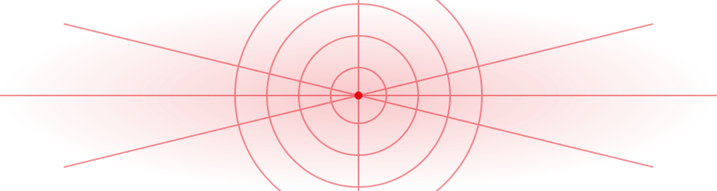

<div align="center">

</div>

<br>

<table width="100%" cellpadding="14" cellspacing="0" border="0">
<tr>
<td valign="middle" align="left">

# MITHIN <font color="#E50914">KRISHNA</font>

### AI BUILDER&nbsp; | &nbsp;FULL-STACK DEVELOPER&nbsp; | &nbsp;FOUNDER

<table cellpadding="10" cellspacing="0" border="1" bordercolor="#E50914">
<tr><td>
<b>◈&nbsp; YOUR FRIENDLY <font color="#E50914">NEIGHBOURHOOD</font> DEVELOPER</b>
</td></tr>
</table>

<br>


</td>
<td align="center" valign="middle">

</td>
</tr>
</table>

<br>

## <font color="#A80712">// ABOUT ME</font>

<table width="100%" cellpadding="16" cellspacing="0" border="0">
<tr>
<td width="55%" valign="top">

I'm a **Computer Science & Engineering** student who enjoys turning ideas into practical software, AI-powered products and automation systems.

I don't want to learn technology just for the sake of knowing it.

**<font color="#E50914">I want to understand it well enough to turn an idea into something people can actually use.</font>**

</td>
<td width="45%" valign="top" bgcolor="#111318">

<table cellpadding="0" cellspacing="0" border="0">
<tr>
<td valign="top">

<font color="#E50914"><b>CURRENTLY FOCUSED ON</b></font>

```
> Artificial Intelligence
> Large Language Models
> AI Agents
> RAG Systems
> Intelligent Automation
> Full-Stack Development
> Product Engineering
```

</td>
<td align="right" valign="top" width="110">

</td>
</tr>
</table>

</td>
</tr>
</table>

<br>

## <font color="#A80712">// PROJECTS</font>

<table width="100%" cellpadding="14" cellspacing="10" border="1" bordercolor="#DDDDDD">
<tr>

<td width="33%" valign="top">

<div align="center">


### SkillSyncX
<b><font color="#E50914">AI Learning & Career Platform</font></b>
</div>

<font color="#333333">
Helping students discover skills, get personalized career roadmaps, build projects and track their growth.
<br><br>
<b>Stack:</b> React • Node.js • Express • MongoDB • JWT
</font>

<div align="center"><br><a href="https://skillsyncx.vercel.app"><b>LIVE PROJECT ↗</b></a></div>

</td>

<td width="33%" valign="top">

<div align="center">


### PrintFlow AI
<b><font color="#E50914">AI Print Shop Automation</font></b>
</div>

<font color="#333333">
Automating print shop operations with WhatsApp ordering, AI document analysis, queue management and intelligent printer automation.
<br><br>
<b>Stack:</b> Node.js • JavaScript • AI • WhatsApp • Automation
</font>

<div align="center"><br><a href="https://github.com/Mithin2007/printflow-ai"><b>GITHUB ↗</b></a></div>

</td>

<td width="33%" valign="top">

<div align="center">


### Trivio
<b><font color="#E50914">AI Placement Preparation</font></b>
</div>

<font color="#333333">
AI-powered placement preparation platform with resume building, aptitude tests and an AI chatbot.
<br><br>
<b>Stack:</b> React • Node.js • JavaScript • Python
</font>

<div align="center"><br><a href="https://trivioo.vercel.app"><b>LIVE PROJECT ↗</b></a></div>

</td>

</tr>
</table>

<br>

<div align="center">

</div>

<br>

## <font color="#A80712">// TECH STACK</font>

**LANGUAGES**
<br>


**FRONTEND**
<br>


**BACKEND**
<br>


**DATA**
<br>


**AI / TOOLS**
<br>


<br>

## <font color="#A80712">// GITHUB STATS</font>

<div align="center">

<a href="https://github.com/Mithin2007"></a>
<a href="https://github.com/Mithin2007"></a>

<br><br>

<a href="https://github.com/Mithin2007"></a>

</div>

> **Live GitHub statistics** — these cards are generated dynamically from the `Mithin2007` GitHub account.

<br>

## <font color="#A80712">// SYSTEM PROFILE</font>

<table width="100%" bgcolor="#111318" cellpadding="18" cellspacing="0" border="0">
<tr>
<td>

```
╔══════════════════════════════════════════════════════╗
║              MITHIN // SYSTEM PROFILE                ║
╠══════════════════════════════════════════════════════╣
║ NAME        → Mithin Krishna                          ║
║ ROLE        → AI Builder / Full-Stack Developer       ║
║ EDUCATION   → Computer Science & Engineering           ║
║ GRADUATION  → 2028                                     ║
║                                                        ║
║ COMPANY     → Invenzo AI Solutions                     ║
║ STATUS      → BUILDING                                 ║
║ SPECIALITY  → AI • LLMs • Agents • Automation          ║
║                                                        ║
║ CURRENTLY EXPLORING                                    ║
║ ├─ Artificial Intelligence                             ║
║ ├─ Large Language Models                               ║
║ ├─ AI Agents                                           ║
║ ├─ RAG Systems                                         ║
║ ├─ Intelligent Automation                              ║
║ ├─ Full-Stack Engineering                              ║
║ └─ Product Development                                 ║
╚══════════════════════════════════════════════════════╝
```

</td>
</tr>
</table>

<br>

## <font color="#A80712">// BUILDING BEYOND THE ORDINARY</font>

<table width="100%" cellpadding="14" cellspacing="0" border="0">
<tr><td>

<font color="#333333">
I don't want to build software just to say I built it.
<br><br>
I want to build things that solve real problems, feel useful, and make people say:
<br><br>
<b><font color="#E50914">"Why didn't this exist before?"</font></b>
</font>

</td></tr>
</table>

<br>

## <font color="#A80712">// LET'S CONNECT</font>

<table width="100%" cellpadding="12" cellspacing="8" border="1" bordercolor="#DDDDDD">
<tr>
<td align="center"><a href="https://github.com/Mithin2007"><b>GitHub</b><br>@Mithin2007</a></td>
<td align="center"><a href="https://invenzoai.in"><b>Invenzo AI</b><br>invenzoai.in</a></td>
<td align="center"><a href="https://skillsyncx.vercel.app"><b>SkillSyncX</b><br>skillsyncx.vercel.app</a></td>
<td align="center"><a href="https://trivioo.vercel.app"><b>Trivio</b><br>trivioo.vercel.app</a></td>
<td align="center" bgcolor="#E50914"><a href="https://www.linkedin.com/in/mithin-krishna-ns/"><font color="#FFFFFF"><b>LinkedIn</b><br>Connect with me</font></a></td>
</tr>
</table>

<br>

<div align="center">


### BUILD • LEARN • SHIP • REPEAT

`< web • code • build • repeat >`

<br>

<b>Thanks for visiting. ❤️</b>

</div>
